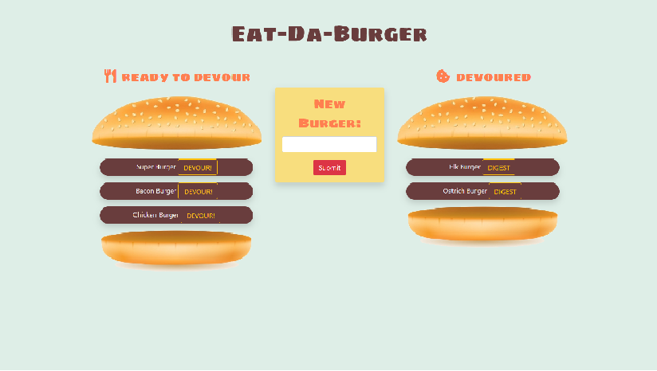

# burgerLogger
________________________________________________________________________________________________________________________________________
________________________________________________________________________________________________________________________________________

**Description:**

* burgerLogger is a an app that lets users input the names of burgers they'd like to eat.

* Whenever a user submits a burger's name, the app will display the burger on the left side of the page -- waiting to be devoured.

* Each burger in the waiting area also has a `Devour it!` button. When the user clicks it, the burger will move to the right side of the page. -- devoured.

* Each Burger in the devoured area has a `DIGEST` button. When the user clicks it, the burger is removed from the database.

* the app stores every burger in a database, whether devoured or not.

**Deployed on Heroku**
**Try it out for yourself**: https://daburgerlogger.herokuapp.com/

 
________________________________________________________________________________________________________________________________________

**Developer input:**

* I mainly built this app to demonstrate how a CRUD system works. (CREATE, READ, UPDATE, DELETE).
* This app was built using the MVC design pattern.

________________________________________________________________________________________________________________________________________

**Software / Methods used:**

* MySQL
* Node (modules: express, mysql, express-handlebars)
* Express
* Handlebars
* ORM
* Heroku (jawsDB addon - to connect to mysql)
* jquery, css

